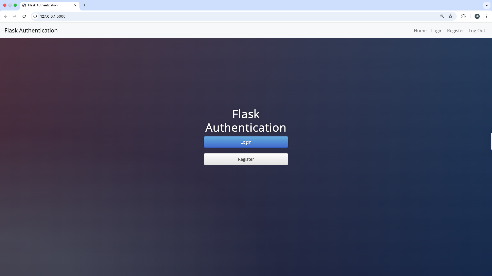

# 🔐 Flask Authentication App

A secure, minimal Flask web application that supports user registration, login/logout, and protected routes — built using modern best practices in Python and Flask.

---

## 📸 Demo



---

## 🚀 Features

- ✅ User registration with hashed + salted passwords (using Werkzeug)
- ✅ Login/logout using `Flask-Login`
- ✅ Protected routes (e.g., `/secrets`, `/download`) that require authentication
- ✅ Flash messages for validation and user feedback
- ✅ SQLite database via SQLAlchemy ORM
- ✅ File download for logged-in users

---

## 🧱 Tech Stack

- **Backend**: Python, Flask, Flask-Login
- **Database**: SQLite + SQLAlchemy ORM
- **Frontend**: Jinja2 templates, Bootstrap (optional)
- **Security**: Password hashing with PBKDF2 + salt

---

## 📂 File Structure

```
flask-auth-app/
├── app.py
├── static/
│   ├── files/
│   │   └── cheat_sheet.pdf
│   └── img/
│       └── screenshot.png
├── templates/
│   ├── index.html
│   ├── register.html
│   ├── login.html
│   └── secrets.html
├── users.db
└── README.md
```

---

## ⚙️ Getting Started

### 1. Clone the repo

```
git clone https://github.com/ayushi-gajendra/Flask_Authentication_App.git
cd Flask_Authentication_App
```

### 2. Create a virtual environment (optional but recommended)

```
python -m venv venv
source venv/bin/activate  # on Windows: venv\Scripts\activate
```

### 3. Install dependencies

```
pip install flask flask-login flask-sqlalchemy
```

### 4. Run the app

```
python main.py
```

Visit `http://127.0.0.1:5000` in your browser.

---

## 🔐 Routes Overview

| Route        | Method(s) | Description                           |
|--------------|-----------|---------------------------------------|
| `/`          | GET       | Home page                             |
| `/register`  | GET/POST  | Sign up as a new user                 |
| `/login`     | GET/POST  | Log in to your account                |
| `/logout`    | GET       | Log out of your session               |
| `/secrets`   | GET       | Protected content (requires login)    |
| `/download`  | GET       | Download PDF (requires login)         |

---

## 📄 License

This project is open-source and available under the [MIT License](LICENSE).
